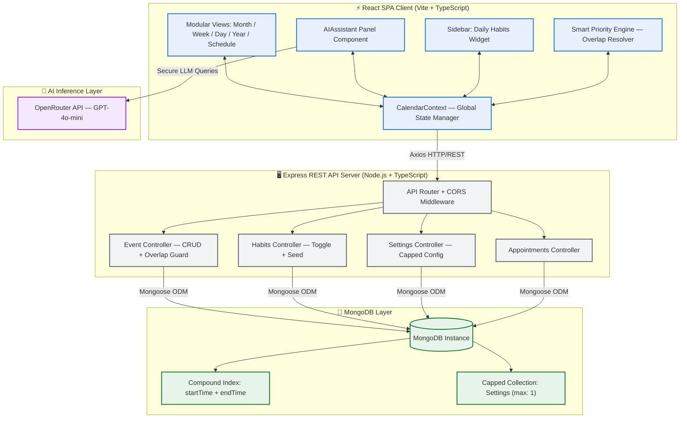
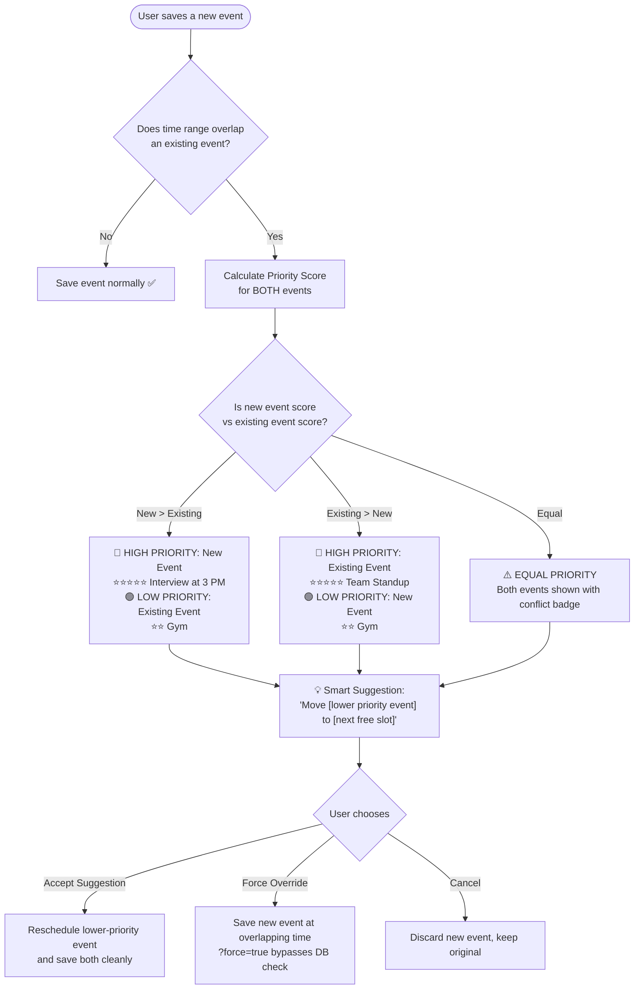
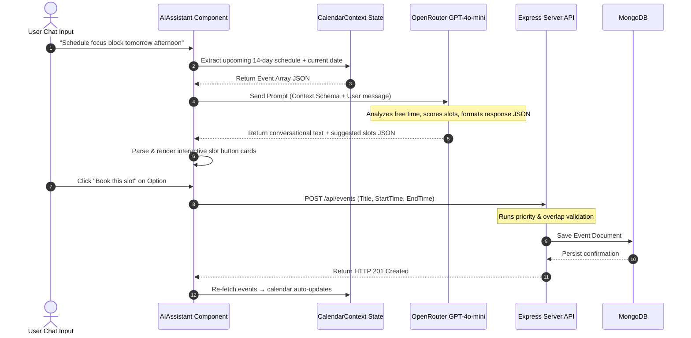
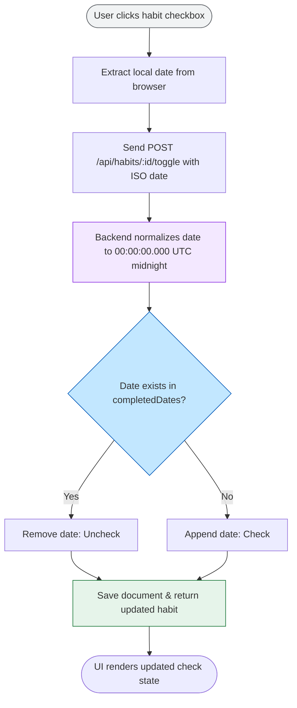

# 🗓️ CalendarX — Google Calendar Clone with AI Assistant & Smart Priority Engine

[](https://reactjs.org/)
[](https://www.typescriptlang.org/)
[](https://nodejs.org/)
[](https://www.mongodb.com/)
[](https://expressjs.com/)
[](https://www.framer.com/motion/)
[](https://openrouter.ai/)

**CalendarX** is a high-fidelity, production-grade calendar ecosystem faithfully reproducing the full visual layout, timezone flexibility, and smooth interactions of Google Calendar. Beyond the core calendar experience, it includes a **Smart Event Priority Engine** for intelligent conflict resolution, a **context-aware AI Schedule Assistant**, an automated **Daily Habit Tracker**, and a customizable **Appointment Booking Engine**.

---

## 📑 Table of Contents

1. [Setup Instructions](#-setup-instructions)
2. [System Architecture](#-system-architecture)
3. [Technology Stack & Rationale](#%EF%B8%8F-technology-stack--rationale)
4. [Business Logic & Edge Cases](#-business-logic--edge-cases)
   - [Smart Event Priority Engine ⭐⭐⭐⭐⭐](#1-smart-event-priority-engine-)
   - [AI Intelligent Schedule Assistant](#2-ai-intelligent-schedule-assistant)
   - [Daily Habit Tracker](#3-daily-habit-tracker)
   - [Appointment Scheduler](#4-appointment-scheduler)
5. [Animations & Interactions](#-animations--interactions)
6. [API Reference](#-api-reference-interface)
7. [Database Schema](#-database-schema-definitions)
8. [Future Enhancements](#-future-enhancements)

---

## 🚀 Setup Instructions

### Prerequisites

Before getting started, ensure your environment meets the following requirements:

| Requirement | Version | Purpose |
|:---|:---|:---|
| **Node.js** | `18.x` or higher | JavaScript runtime for both client and server |
| **npm** | `9.x` or higher | Package manager (bundled with Node.js) |
| **MongoDB** | `6.x` or higher | Database — local instance or MongoDB Atlas |
| **OpenRouter API Key** | — | Powers the AI Schedule Assistant feature |

---

### Step 1 — Clone the Repository

```bash
git clone https://github.com/your-username/CalendarX.git
cd CalendarX/GoogleCalender
```

---

### Step 2 — Configure Environment Variables

The project uses two separate `.env` files — one for the server and one for the client.

#### 🔧 Server Environment (`server/.env`)

Create a file at `server/.env` with the following content:

```env
PORT=5000
MONGODB_URI=mongodb://localhost:27017/google-calendar-clone
NODE_ENV=development
```

> [!NOTE]
> To use MongoDB Atlas instead of a local instance, replace `MONGODB_URI` with your Atlas connection string:
> `MONGODB_URI=mongodb+srv://<username>:<password>@cluster0.xxxxx.mongodb.net/google-calendar-clone`

#### 🌐 Client Environment (`client/.env`)

Create a file at `client/.env` with the following content:

```env
VITE_API_URL=http://localhost:5000
VITE_OPENROUTER_API_KEY=your_openrouter_api_key_here
```

> [!IMPORTANT]
> The `VITE_OPENROUTER_API_KEY` is required for the AI Schedule Assistant to function. Obtain a free key from [openrouter.ai](https://openrouter.ai/).

---

### Step 3 — Install Dependencies & Start the Backend

```bash
# Navigate to the server directory
cd server

# Install all Node.js dependencies
npm install

# Start the development server (with hot-reload via ts-node-dev)
npm run dev
```

✅ The server will start at **http://localhost:5000**

On first start, the server automatically **seeds default habits** (Drink Water, Read, Work Out, Meditate) into the database if no habits are found.

---

### Step 4 — Install Dependencies & Start the Frontend

Open a **second terminal window** and run:

```bash
# Navigate to the client directory
cd client

# Install all frontend dependencies
npm install

# Start the Vite development server
npm run dev
```

✅ The Vite dev server will launch the app at **http://localhost:5173**

---

### Step 5 — Verify the App is Running

| Service | URL | Expected Status |
|:---|:---|:---|
| **Frontend** | http://localhost:5173 | Calendar UI loads |
| **Backend API** | http://localhost:5000/api/events | Returns `[]` or event array |
| **Habits API** | http://localhost:5000/api/habits | Returns seeded habits array |

> [!TIP]
> Run the server **before** the client to avoid API connection errors on initial load.

---

## 🏗️ System Architecture

CalendarX is built on a decoupled **Client–Server** architecture. The React SPA communicates with an Express REST API, which persists data to a MongoDB layer via the Mongoose ODM.



### Architecture Decisions

| Decision | Rationale |
|:---|:---|
| **Decoupled SPA + REST API** | Enables independent scaling, separate deployment pipelines, and clean contract boundaries between frontend and backend. |
| **Global `CalendarContext`** | Centralizes all event/settings state to prevent prop-drilling and allows any component (AI panel, sidebar, modal) to read/write data consistently. |
| **Compound Index on `startTime + endTime`** | Dramatically speeds up overlap range queries (`$lt`/`$gt`) that are the backbone of the conflict detection engine. |
| **Capped Settings Collection** | Enforces a singleton pattern at the database level rather than application level — zero chance of configuration drift. |

---

## 🛠️ Technology Stack & Rationale

| Architectural Layer | Selected Stack | Strategic Rationale |
| :--- | :--- | :--- |
| **Frontend Framework** | React 18 (TypeScript) | Strong component encapsulation, descriptive hook patterns, and compile-time type safety across the entire component tree. |
| **Build Pipeline** | Vite | Rapid Hot Module Replacement (HMR) and significantly minimized production bundle sizes compared to Webpack-based setups. |
| **Animation Engine** | Framer Motion | Fluid view transitions via `AnimatePresence` and Spring physics; GPU-composited transforms (`x`, `y`, `opacity`) for 60fps animations. |
| **Styling System** | Tailwind CSS + CSS Custom Properties | Fast design cycles with utility classes; CSS Variables enable dynamic light/dark/system theming without JavaScript overhead. |
| **Server Engine** | Node.js + Express (TypeScript) | Non-blocking I/O event loop ideal for calendar data serving; TypeScript ensures shared type definitions between client and server API contracts. |
| **Database Adapter** | MongoDB + Mongoose | Schema-flexible JSON documents naturally match calendar event structures; array mutation operators (`$push`, `$pull`) simplify habit toggle logic. |
| **Date Processing** | `date-fns` | Tree-shakeable — only imported functions are bundled. Provides robust boundary calculations (`startOfWeek`, `endOfMonth`) without timezone pitfalls. |
| **AI Provider** | OpenRouter (GPT-4o-mini) | Abstracts over multiple LLM providers; `gpt-4o-mini` offers the optimal cost/performance ratio for scheduling reasoning tasks. |

---

## 🧠 Business Logic & Edge Cases

### 1. Smart Event Priority Engine ⭐

> **Core Idea**: Every event carries a hidden priority score. When two events conflict, CalendarX doesn't just say "overlap detected" — it *ranks* them, explains *why* one matters more, and *suggests an intelligent resolution*.

#### 1.1 Priority Score Calculation

Each event is assigned a priority score on a **1–5 star scale** based on five weighted factors:

| Factor | Weight | Scoring Logic |
|:---|:---|:---|
| **User-set Importance** | `+2 pts` | User explicitly marked the event as high-priority during creation |
| **Event Type** | `+2 pts` | `appointment` or `event` (meeting-like) > `task` (personal todo) |
| **Deadline Proximity** | `+1 pt` | Events starting within the next 3 hours are escalated |
| **Number of Attendees** | `+1 pt` | Events with 2+ guests are treated as collaborative commitments |
| **Recurrence** | `+1 pt` | Recurring events represent ingrained routines and are ranked higher |

**Maximum raw score: 7 points → normalized to 1–5 stars.**

```
Priority Stars = ceil((rawScore / 7) × 5)
```

#### 1.2 Conflict Resolution Flow

When a new event is saved and the overlap detector fires a **409 Conflict**, the priority engine kicks in:



#### 1.3 Smart Suggestion UI Example

When a conflict is detected between **Interview (3–4 PM)** and **Gym (3–4 PM)**, instead of a generic error, users see:

```
┌─────────────────────────────────────────────────────┐
│  ⚠️  Scheduling Conflict Detected                   │
├─────────────────────────────────────────────────────┤
│  🔴 High Priority Event          Score: ⭐⭐⭐⭐⭐  │
│  📋 Interview                                        │
│     Today, 3:00 PM – 4:00 PM                        │
│     👥 4 Attendees · 🔗 Meet Link                   │
├─────────────────────────────────────────────────────┤
│  🟢 Lower Priority Event         Score: ⭐⭐         │
│  🏋️ Gym                                             │
│     Today, 3:00 PM – 4:00 PM                        │
│     👤 Personal Task                                │
├─────────────────────────────────────────────────────┤
│  💡 Suggestion:                                      │
│     Move "Gym" to 6:00 PM (next free slot).         │
│                                                     │
│  [✅ Accept Suggestion]  [⚡ Force Save]  [❌ Cancel] │
└─────────────────────────────────────────────────────┘
```

#### 1.4 Why This Matters

Standard calendar apps treat all events as equal-weight and simply block new bookings. The Smart Priority Engine introduces **decision-making intelligence** into the scheduling flow — the app reasons about *which commitment matters more* and proposes actionable solutions rather than leaving the user to manually resolve conflicts.

---

### 2. AI Intelligent Schedule Assistant

The AI Schedule Helper is a side-panel chat assistant powered by `openai/gpt-4o-mini` via OpenRouter. It reads the user's real-time event context and helps find, reason about, and book available time slots through natural language.

#### 2.1 System Prompt Architecture & Flow



#### 2.2 Structured Slot Response Format

The AI returns a hybrid response — conversational text + a parseable JSON block:

```json
{
  "slots": [
    {
      "start": "2026-06-28T14:00:00.000Z",
      "end":   "2026-06-28T15:00:00.000Z",
      "label": "Focus Block — Saturday Afternoon",
      "score": 9,
      "reason": "No meetings within 2-hour buffer, aligned with your past focus patterns"
    }
  ]
}
```

The client strips the JSON block from chat display and mounts interactive **"Book this slot"** cards. One click pre-populates the event modal and saves instantly.

#### 2.3 Edge Cases Handled
- **Holiday exemptions**: Events marked as holidays are highlighted in the context but not treated as busy-blocks for scheduling.
- **Business hours enforcement**: The system prompt restricts slot suggestions to `09:00–20:00` local time by default.
- **Back-to-back buffer**: AI is instructed to prefer slots with at least 15-minute breathing room between existing events.

---

### 3. Daily Habit Tracker

Designed to build consistent daily routines with integrated alarm notifications.

#### 3.1 Timezone-Stable Toggle Logic



**Why UTC midnight normalization?** A user in UTC+5:30 checking off a habit at 11 PM local time would store `18:30 UTC` — which is technically *the previous day* in UTC. Normalizing to `00:00:00.000 UTC` ensures the completion is always associated with the correct calendar day regardless of timezone.

#### 3.2 Seeding Mechanism
On server startup, the habits controller checks `await Habit.countDocuments()`. If the count is `0`, it inserts four default habits (Drink Water 💧, Read 📖, Work Out 🏋️, Meditate 🧘) to ensure an immediate ready-to-use experience without manual setup.

#### 3.3 Alarm System
- Each habit stores an optional `alarmTime` field in `"HH:mm"` 24-hour format.
- The sidebar runs a `setInterval` tick every 60 seconds comparing the current local time against active `alarmTime` values.
- When matched, a visual pulse indicator and browser notification are triggered.

---

### 4. Appointment Scheduler

Supports an end-to-end Appointment Booking Engine where users define their availability windows, generate shareable booking links, and allow external users to self-serve appointments.

#### 4.1 Overlap Protection
When an external user books an appointment, the engine performs a real-time busy-slot check:
- Fetches all host events within the requested window from MongoDB.
- Applies the same overlap formula: `(S₁ < E₂) ∧ (E₁ > S₂)`
- Rejects bookings that clash with existing calendar events.

#### 4.2 Key Edge Cases

**Multi-timezone Date Normalization:**
All dates are stored in **UTC (ISO 8601)** and displayed using the browser's native `Intl.DateTimeFormat` in the user's local timezone — preventing display discrepancies across geographical locations.

**Double-Booking Overlap Detection & Override:**
$$\text{Overlap Condition: } (S_1 < E_2) \land (E_1 > S_2)$$
- Detected overlaps return **HTTP 409 Conflict** with the conflicting event payload.
- Users may append `?force=true` to bypass the check and save the event anyway.

**Capped Settings Collection:**
The database enforces a singleton settings document via a MongoDB capped collection:
```js
{ capped: { size: 1024, max: 1 } }
```
This eliminates configuration drift and makes settings reads O(1) with no lookup overhead.

---

## 🎨 Animations & Interactions

CalendarX uses **Framer Motion** as its primary animation engine, with supplemental CSS animations for lightweight effects.

### View Transitions (Month / Week / Day / Year)

```typescript
// CalendarView.tsx — sliding page animation
const variants = {
  enter: (direction: number) => ({
    x: direction > 0 ? 300 : -300,
    opacity: 0
  }),
  center: { x: 0, opacity: 1 },
  exit:  (direction: number) => ({
    x: direction > 0 ? -300 : 300,
    opacity: 0
  })
};

<AnimatePresence custom={direction} mode="wait">
  <motion.div
    key={viewKey}
    custom={direction}
    variants={variants}
    initial="enter"
    animate="center"
    exit="exit"
    transition={{ type: "spring", stiffness: 260, damping: 28 }}
  />
</AnimatePresence>
```

**Why Spring physics?** Unlike duration-based `ease` curves, spring animations feel physically natural — they don't suddenly stop; they settle organically. `stiffness: 260, damping: 28` strikes the ideal balance between snappiness and smoothness.

### Modal Entry / Exit

Event modals use a **scale + fade** choreography:

```typescript
// EventModal.tsx
initial={{ opacity: 0, scale: 0.92, y: 20 }}
animate={{ opacity: 1, scale: 1,    y: 0  }}
exit={{    opacity: 0, scale: 0.92, y: 20  }}
transition={{ type: "spring", stiffness: 280, damping: 24 }}
```

The `y: 20` offset creates the impression that the modal "rises" from the click point, matching Google's Material Design motion principles.

### Glassmorphism Effect

Context panels and overlays apply CSS backdrop blur for a premium frosted-glass appearance:

```css
.glass-panel {
  background: rgba(255, 255, 255, 0.85);
  backdrop-filter: blur(12px);
  -webkit-backdrop-filter: blur(12px);
  border: 1px solid rgba(255, 255, 255, 0.3);
  box-shadow: 0 8px 32px rgba(0, 0, 0, 0.08);
}
```

### "Now" Indicator (Red Line)

The current-time line in Day/Week views is driven by a self-updating CSS custom property:

```typescript
// Updates every 60 seconds
const updateNowPosition = () => {
  const now = new Date();
  const minutesSinceMidnight = now.getHours() * 60 + now.getMinutes();
  const topPercent = (minutesSinceMidnight / 1440) * 100;
  document.documentElement.style.setProperty('--now-top', `${topPercent}%`);
};

setInterval(updateNowPosition, 60_000);
```

```css
.now-indicator {
  top: var(--now-top);
  transition: top 1s linear; /* Smooth creep forward */
}
```

### Micro-interaction Inventory

| Element | Animation | Technical Detail |
|:---|:---|:---|
| **Event chips on hover** | Subtle lift + shadow deepen | `transform: translateY(-1px)` + shadow transition |
| **Sidebar habit checkboxes** | Bounce-in checkmark | CSS `@keyframes` scale 0→1.2→1 |
| **AI slot cards** | Stagger-in on message arrival | Framer `staggerChildren: 0.08` |
| **Mini-calendar day dots** | Pulse glow on events | CSS `animation: pulse 2s infinite` |
| **Loading skeleton** | Shimmer wave | `background: linear-gradient(90deg, ...)` animated `background-position` |
| **Priority stars** | Fill animation on score reveal | CSS `clip-path` progressive reveal |

---

## 🔌 API Reference Interface

### Events API (`/api/events`)

| Method | Endpoint | Parameters | HTTP Code | Response |
| :--- | :--- | :--- | :--- | :--- |
| **GET** | `/` | `start`, `end` (ISO 8601) | `200 OK` | Array of Event documents sorted by `startTime` |
| **POST** | `/` | Event JSON body | `201 Created` / `409 Conflict` | Saved event or overlap conflict payload |
| **PATCH** | `/:id` | Event delta JSON body | `200 OK` / `409 Conflict` | Updated event or overlap conflict payload |
| **DELETE** | `/:id` | None | `200 OK` | Deletion confirmation message |

> [!NOTE]
> Append `?force=true` to POST and PATCH requests to bypass double-booking checks.

### Habits API (`/api/habits`)

| Method | Endpoint | Parameters | HTTP Code | Response |
| :--- | :--- | :--- | :--- | :--- |
| **GET** | `/` | None | `200 OK` | Array of habits with `completedDates` |
| **POST** | `/` | `{ name, emoji?, alarmTime? }` | `201 Created` | New Habit document |
| **POST** | `/:id/toggle` | `{ date: ISOString }` | `200 OK` | Updated habit with modified `completedDates` |
| **PATCH** | `/:id` | Habit properties delta | `200 OK` | Updated Habit document |
| **DELETE** | `/:id` | None | `200 OK` | Deletion confirmation |
| **POST** | `/seed` | None | `200 OK` / `400` | Seeds defaults if count is zero |

### Settings API (`/api/settings`)

| Method | Endpoint | Parameters | HTTP Code | Response |
| :--- | :--- | :--- | :--- | :--- |
| **GET** | `/` | None | `200 OK` | Singleton settings document |
| **PATCH** | `/` | Settings delta JSON body | `200 OK` | Updated settings document |

---

## 📊 Database Schema Definitions

### Event Schema (`Event.ts`)

```typescript
{
  title:       { type: String, required: true },
  description: { type: String },
  startTime:   { type: Date, required: true },  // Stored in UTC
  endTime:     { type: Date, required: true },   // Stored in UTC
  location:    { type: String },
  guests:      { type: [String], default: [] },
  meetLink:    { type: String },
  color:       { type: String, default: '#4285f4' },
  eventType:   { type: String, enum: ['event', 'task', 'appointment'], default: 'event' },
  isRecurring: { type: Boolean, default: false },
  recurrenceRule: {
    frequency: { type: String, enum: ['daily', 'weekly', 'monthly'] },
    interval:  { type: Number, default: 1 },
    endDate:   { type: Date }
  },
  // Priority Engine fields
  priorityScore:    { type: Number, min: 1, max: 5, default: null },
  userImportance:   { type: Boolean, default: false },
  attendeeCount:    { type: Number, default: 0 },
  metadata:         { type: Schema.Types.Mixed, default: {} }
}
```

*Compound Index: `{ startTime: 1, endTime: 1 }` — optimizes all range overlap queries.*

### Habit Schema (`Habit.ts`)

```typescript
{
  name:           { type: String, required: true, unique: true },
  emoji:          { type: String, default: '✨' },
  completedDates: { type: [Date], default: [] },  // Normalized to 00:00:00.000 UTC
  color:          { type: String, default: '#0b57d0' },
  alarmTime:      { type: String, default: null },   // "HH:mm" 24-hour format
  isAlarmEnabled: { type: Boolean, default: false }
}
```

### Settings Schema (`Settings.ts`)

```typescript
{
  defaultView:    { type: String, enum: ['month', 'week', 'day', 'year', 'schedule'], default: 'week' },
  timezone:       { type: String, default: 'auto' },
  theme:          { type: String, enum: ['light', 'dark', 'system'], default: 'system' },
  weekStartsOn:   { type: Number, enum: [0, 1], default: 0 }   // 0 = Sunday, 1 = Monday
}
```

*Capped Collection: `{ size: 1024, max: 1 }` — enforces singleton at the database level.*

---

## 🔮 Future Enhancements

The following features are planned for future iterations, ranked by impact and complexity:

### 🥇 Tier 1 — High Impact, Achievable

| Enhancement | Description |
|:---|:---|
| **Priority Score Persistence** | Fully persist the `priorityScore` field in the Event model and auto-calculate it on event creation based on the 5-factor formula. Surface the score as colored star badges on event chips in Month/Week views. |
| **One-Click Conflict Reschedule** | When the Priority Engine suggests "Move Gym to 6 PM", implement the auto-reschedule action that patches the lower-priority event's `startTime`/`endTime` in a single API call with no manual editing. |
| **AI-Powered Daily Digest** | Each morning, the AI assistant generates a 3-sentence summary of the day's schedule — highlighting the highest-priority meeting, any conflicts, and suggested preparation time. |
| **Recurring Event Exceptions** | Allow users to modify a single instance of a recurring event ("this event only") without breaking the entire recurrence series, using RRULE exception date logic. |

### 🥈 Tier 2 — Medium Impact, Moderate Complexity

| Enhancement | Description |
|:---|:---|
| **Google OAuth Integration** | Replace manual event creation with real Google account sync via OAuth 2.0, importing existing Google Calendar events. |
| **Real-time Collaboration** | Use WebSockets (Socket.io) to broadcast event mutations to multiple connected clients — enabling shared team calendars with live updates. |
| **Drag-and-Drop Rescheduling** | Implement `@dnd-kit` or `react-beautiful-dnd` to allow events to be dragged across the Week/Day grid and dropped on new time slots, triggering a PATCH request automatically. |
| **Smart Recurring Suggestions** | After a user creates an event manually more than 3 times with the same title, the AI suggests converting it into a recurring event. |
| **Push Notifications** | Integrate the Web Push API with a Service Worker to deliver reminders outside the browser tab, even when the app is not focused. |

### 🥉 Tier 3 — Long-term, High Complexity

| Enhancement | Description |
|:---|:---|
| **Multi-user Tenant Architecture** | Scope all MongoDB documents to a `userId` field, add JWT-based authentication middleware, and support fully isolated personal calendars per user. |
| **Priority ML Model** | Replace the rule-based scoring formula with a lightweight ML model (e.g., scikit-learn exported to ONNX) trained on user rescheduling patterns to learn personalized priority weights over time. |
| **Natural Language Event Creation** | Allow users to type "Lunch with Sarah next Tuesday 12–1" anywhere in the UI and have the AI parse it into a structured event object via function calling. |
| **Calendar Federation** | Sync with Outlook, Apple Calendar, and Notion databases via their respective APIs, providing a unified multi-source calendar hub. |
| **Offline-First with IndexedDB** | Cache the 30-day event window in IndexedDB and expose a Service Worker that queues writes when offline, syncing them transparently when connectivity is restored. |

---

## 📁 Project Structure

```
GoogleCalender/
├── client/                    # React SPA Frontend
│   ├── src/
│   │   ├── components/        # All UI components
│   │   │   ├── AIAssistant.tsx        # AI chat panel
│   │   │   ├── AppointmentPanel.tsx   # Booking availability editor
│   │   │   ├── BookingPage.tsx        # External booking page
│   │   │   ├── CalendarView.tsx       # Animated view switcher
│   │   │   ├── DayView.tsx            # 24-hour day grid
│   │   │   ├── EventModal.tsx         # Create/edit event form
│   │   │   ├── FourDayView.tsx        # 4-day rolling view
│   │   │   ├── Header.tsx             # Top nav + view controls
│   │   │   ├── MonthView.tsx          # Month grid
│   │   │   ├── ScheduleView.tsx       # Upcoming events list
│   │   │   ├── Sidebar.tsx            # Mini-cal + habits + calendars
│   │   │   ├── TasksView.tsx          # Standalone tasks panel
│   │   │   ├── WeekView.tsx           # 7-column week grid
│   │   │   └── YearView.tsx           # 12-month year overview
│   │   ├── context/
│   │   │   └── CalendarContext.tsx    # Global state manager
│   │   ├── utils/                     # Shared helpers & formatters
│   │   ├── App.tsx                    # Root router + layout
│   │   ├── main.tsx                   # Vite entry point
│   │   └── index.css                  # Global design tokens
│   └── .env                           # Client environment config
│
├── server/                    # Express REST API Backend
│   ├── src/
│   │   ├── controllers/
│   │   │   └── eventController.ts     # Event CRUD + overlap guard
│   │   ├── models/                    # Mongoose schemas
│   │   ├── routes/                    # Express route definitions
│   │   └── index.ts                   # Server bootstrap + DB connect
│   └── .env                           # Server environment config
│
└── README.md
```

---

## 🏆 Credits

Built as a high-fidelity engineering demonstration of a full-stack production calendar application, implementing Google Calendar's core UX with architectural best practices and novel business logic (Smart Priority Engine).

**Tech stack**: React 18 · TypeScript · Vite · Framer Motion · Node.js · Express · MongoDB · Mongoose · date-fns · OpenRouter AI
