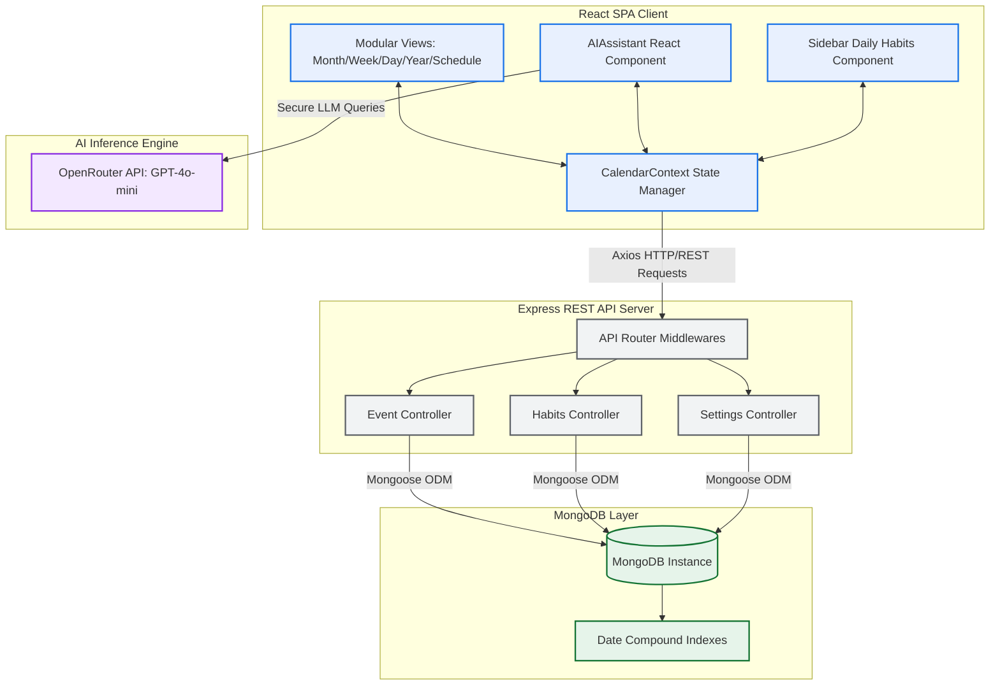
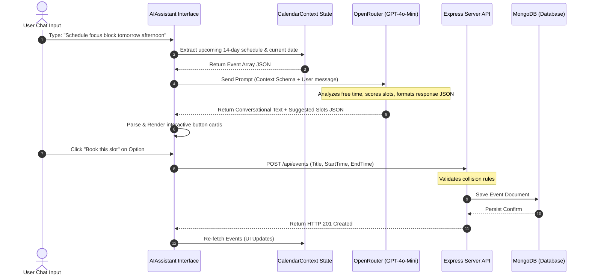
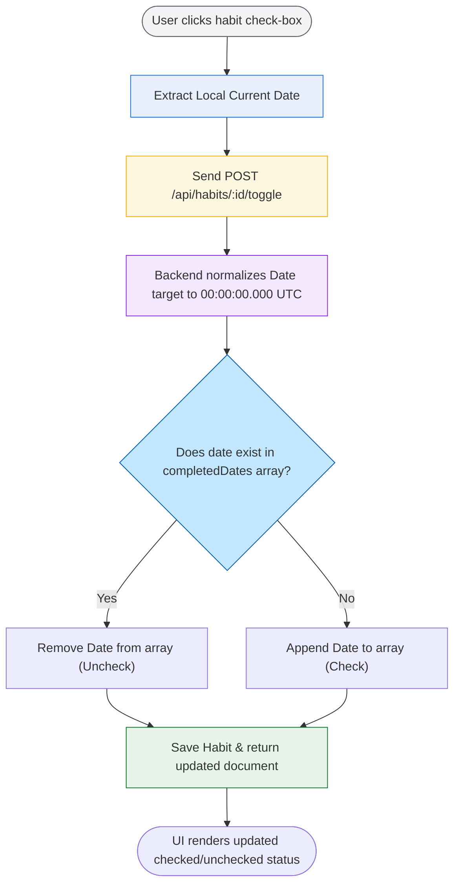

# 🗓️ CalendarX — Google Calendar Clone with AI Assistant & Habit Tracker

[](https://reactjs.org/)
[](https://www.typescriptlang.org/)
[](https://nodejs.org/)
[](https://www.mongodb.com/)
[](https://expressjs.com/)
[](https://www.framer.com/motion/)
[](https://openrouter.ai/)

**CalendarX** is a high-fidelity, production-grade calendar ecosystem reproducing the core visual layout, timezone flexibility, and smooth interactions of Google Calendar. Engineered for high performance, it includes advanced features: a context-aware **AI Schedule Assistant**, an automated **Daily Habit Tracker**, and a customizable **Appointment Booking Engine**. 

---

## 🏗️ System Architecture

CalendarX is built on a decoupled Client-Server architecture utilizing a Mongoose-managed MongoDB layer.



---

## ⚡ Main Feature Breakdown

### 🤖 1. AI Intelligent Schedule Assistant
The AI Schedule Helper is a side-panel chat assistant powered by `openai/gpt-4o-mini` (via OpenRouter). It extracts real-time event status and timezone information directly from context to help users identify and schedule available slots through conversational natural language.

#### 💡 System Prompt Core Logic & Flow
1. **Context Harvesting**: The client reads the user's upcoming 14 days of events from the global `CalendarContext` and maps them to a simplified JSON array (titles, start/end times, and designated holiday markers).
2. **Context Delivery**: The array and the formatted current time are injected into the LLM system prompt.
3. **Reasoning & Layout**: The AI evaluates the scheduling constraints (business hours prefix, overlaps, holiday exemptions) and proposes the 3 best available time slots. It assigns a rating (`1-10`) and dynamic reasons for each option.
4. **Structured Communication**: The AI returns a conversation response followed by a structured JSON block:
   ```json
   {
     "slots": [
       {
         "start": "ISO8601 String",
         "end": "ISO8601 String",
         "label": "Slot Label",
         "score": 9,
         "reason": "Why this slot fits best"
       }
     ]
   }
   ```
5. **Interactive Actions**: The client-side UI parses the JSON block, filters out text, and mounts interactive slot components. Clicking **"Book this slot"** initiates an event creation callback, prepopulating the event details in a single click.



---

### 💧 2. Daily check-in / Habit Tracker
Designed to build daily routines, this sidebar component allows users to register, edit, and keep track of daily habits with an integrated alarm notifications system.

#### 💡 Technical Details
- **Seeding mechanism**: The server checks database records on startup. If no habits are found, it seeds default habits (e.g., *Drink Water*, *Read*, *Work out*, *Meditate*) to ensure an immediate starting experience.
- **Timezone-Stable Dates**: When toggling completion, the system normalizes the check-in date to UTC midnight (`00:00:00.000`) before storing it. This ensures that habits checked off on the same calendar day appear completed regardless of local timezone deviations.
- **Alarm integration**: Custom alarms (`alarmTime` string formatted as `"HH:mm"`) can be enabled. The sidebar monitors system time and displays active indicators to notify the user of pending habits.



---

### 📅 3. Appointment Scheduler
In addition to traditional events, the platform supports an Appointment Booking Engine. Users can define availability windows, generate public booking links (`/booking/:hostId`), and allow external users to book slots. The engine matches requests against existing host calendar busy slots to prevent overlaps.

---

## 🛠️ Technology Stack & Rationale

| Architectural Layer | Selected Stack | Strategic Rationale |
| :--- | :--- | :--- |
| **Frontend Framework** | React 18 (TypeScript) | Strong component encapsulation, descriptive hook patterns, and compile-time type safety. |
| **Build Pipeline** | Vite | Rapid Hot Module Replacement (HMR) and minimized production bundle sizes. |
| **Animation Routing** | Framer Motion | Fluid transitions between Month/Week/Day views via `AnimatePresence` and custom sliding animations. |
| **Design System** | Tailwind CSS + CSS Variables | Fast design cycles, consistent responsive layout parameters, and dynamic light/dark/system mode configurations. |
| **Server Engine** | Node.js + Express (TS) | Fast, non-blocking I/O event loops matching TypeScript typing definitions from client to database. |
| **Database Adapter**| MongoDB + Mongoose | Highly flexible documents matching JSON format, supporting quick array mutations (e.g. `completedDates`). |
| **Date Processing** | `date-fns` | Tree-shakeable date operations, lightweight relative timezone conversions, and easier window boundaries calculation. |

---

## 🎯 Important Edge Cases Handled

### 1. Multi-timezone Date Normalization
- All date values are written to the database in **UTC (ISO 8601)** formats.
- When fetched, the React client parses timestamps and displays them in the user's **native local timezone** using standard browser API bindings. This prevents discrepancies when scheduling events across geographical locations.

### 2. Double-Booking Overlap Detection & Override
- Creating or updates to events performs a database overlap check across the requested `[startTime, endTime]` range.
- If a clash is detected, the server returns an **HTTP 409 Conflict** error containing the conflicting event document:
  $$\text{Overlap Condition: } (S_1 < E_2) \land (E_1 > S_2)$$
- The UI triggers an overlay options modal allowing the user to abort or choose to force create. Forcing appends `?force=true` to the request query, bypasses DB conflict checks, and saves the file.

### 3. Capped Configurations Settings Singletons
- To keep the database light, the collection for `Settings` utilizes a **Capped Collection** configuration setting:
  `{ capped: { size: 1024, max: 1 } }`
- This ensures only one layout configuration exists at a time, preventing bloating and eliminating collection lookup latency.

---

## 🔌 API Reference Interface

### Events API (`/api/events`)

| Method | Endpoint | Query Options / Body Parameters | Return HTTP Code | Response Payload Description |
| :--- | :--- | :--- | :--- | :--- |
| **GET** | `/` | `start`, `end` (ISO 8601 limit bounds) | `200 OK` | Array of Event documents sorted by `startTime`. |
| **POST**| `/` | Event JSON Data payload (body) | `201 Created` / `409 Conflict` | Saved Event details or Overlap Warn JSON details. |
| **PATCH**| `/:id` | Event JSON Delta modifications (body) | `200 OK` / `409 Conflict` | Saved Event details or Overlap Warn JSON details. |
| **DELETE**| `/:id` | None | `200 OK` | Confirmation message of successful deletion. |

> [!NOTE]
> Add `?force=true` query parameters to POST and PATCH calls to bypass double-booking checks.

### Habits API (`/api/habits`)

| Method | Endpoint | Query Options / Body Parameters | Return HTTP Code | Response Payload Description |
| :--- | :--- | :--- | :--- | :--- |
| **GET** | `/` | None | `200 OK` | Array of habit trackers containing completion logs. |
| **POST**| `/` | `{ name: string, emoji?: string, alarmTime?: string }` | `201 Created` | Newly initialized Habit tracker document. |
| **POST**| `/:id/toggle`| `{ date: ISOString }` | `200 OK` | Updated Habit containing the modified `completedDates` array. |
| **PATCH**| `/:id` | Habit properties modification payload | `200 OK` | Updated Habit details. |
| **DELETE**| `/:id` | None | `200 OK` | Confirmation message of deleted Habit. |
| **POST**| `/seed` | None | `200 OK` / `400 Bad req` | Seeds basic habit documents if table count is zero. |

---

## 📊 Database Schema Definitions

### Mongoose event schema details (`Event.ts`)
```typescript
{
  title: { type: String, required: true },
  description: { type: String },
  startTime: { type: Date, required: true }, // Saved in UTC
  endTime: { type: Date, required: true },   // Saved in UTC
  location: { type: String },
  guests: { type: [String], default: [] },
  meetLink: { type: String },
  color: { type: String, default: '#4285f4' },
  eventType: { type: String, enum: ['event', 'task', 'appointment'], default: 'event' },
  isRecurring: { type: Boolean, default: false },
  recurrenceRule: {
    frequency: { type: String, enum: ['daily', 'weekly', 'monthly'] },
    interval: { type: Number, default: 1 },
    endDate: { type: Date }
  },
  metadata: { type: Schema.Types.Mixed, default: {} }
}
```
*Indexing rule configured: Compound Index `{ startTime: 1, endTime: 1 }`.*

### Mongoose habits schema details (`Habit.ts`)
```typescript
{
  name: { type: String, required: true, unique: true },
  emoji: { type: String, default: '✨' },
  completedDates: { type: [Date], default: [] }, // Normalized to 00:00:00.000 UTC
  color: { type: String, default: '#0b57d0' },
  alarmTime: { type: String, default: null },   // "HH:mm" representation
  isAlarmEnabled: { type: Boolean, default: false }
}
```

---

## 🚀 Dev Setup & Local Installation

### Prerequisites
- Node.js version 18.x or higher installed.
- Local MongoDB instance operational (`mongodb://localhost:27017`) or active remote connection URI.

### Step 1: Environment Variables Configuration
Configure environment files before initializing service dependencies.

#### Server Settings (`server/.env`)
Create a file named `.env` in the server root folder:
```env
PORT=5000
MONGODB_URI=mongodb://localhost:27017/google-calendar-clone
NODE_ENV=development
```

#### Client Settings (`client/.env`)
Create a file named `.env` in the client root folder:
```env
VITE_API_URL=http://localhost:5000
VITE_OPENROUTER_API_KEY=your_openrouter_api_key_here
```

### Step 2: Running backend servers
```bash
cd server
npm install
npm run dev
```
The server starts listening on **http://localhost:5000**.

### Step 3: Run the web application frontend
```bash
cd client
npm install
npm run dev
```
The Vite development server will start the application at **http://localhost:5173**.

---

## 🎨 UI Aesthetics & Micro-interactions
- **Glassmorphism Panels**: Context panels and model menus apply backdrop filter blurs (`backdrop-filter: blur(12px)`) combining alpha-blended white values for a clean overlay look.
- **Visual Pulse Effects**: Key active states (e.g. ongoing tasks and loading actions) show subtle CSS glow transitions.
- **Framer Motion Micro-animations**: Modals use Spring dynamics (`stiffness: 260`, `damping: 28`) to animate changes, preventing sudden layout shifts.
- **Red "Now" Indicator Line**: Automatically positions itself vertically on Day/Week views to show current user progress, using a clean ticking animation loop.
